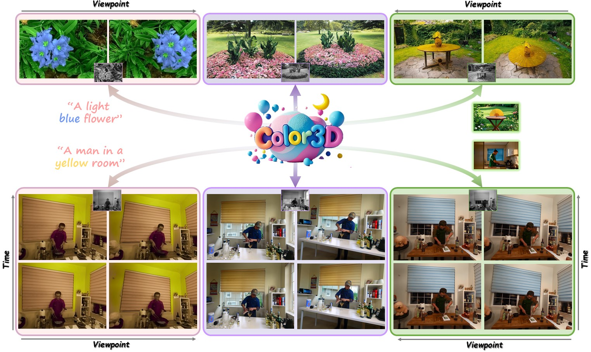
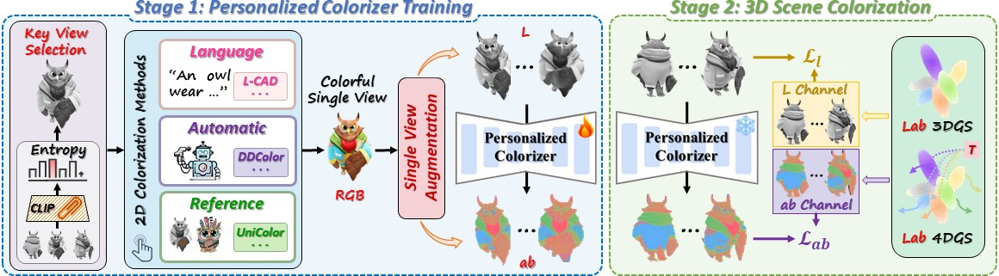

# Color3D: Controllable and Consistent 3D Colorization with Personalized Colorizer (ICLR 2026)
<table>
  <tr>
    <td>  </td>
  </tr>
</table>

## :bulb: Highlight
 - :heart_eyes: :heart_eyes: Color3D is a unified controllable 3D colorization framework for both static and dynamic scenes, producing vivid and chromatically rich renderings with strong cross-view and cross-time consistency.

## :label: TODO 
- [x] Release video demo.
- [ ] Release codes for personalized colorizer.
- [ ] Release training codes.

## :medal_military: Framework Architecture
<table>
  <tr>
    <td>  </td>
  </tr>
  <tr>
    <td>
<b>Overall Framework of Color3D</b>
</td>
  </tr>
</table>

​      
## :hammer_and_wrench: Installation

...

